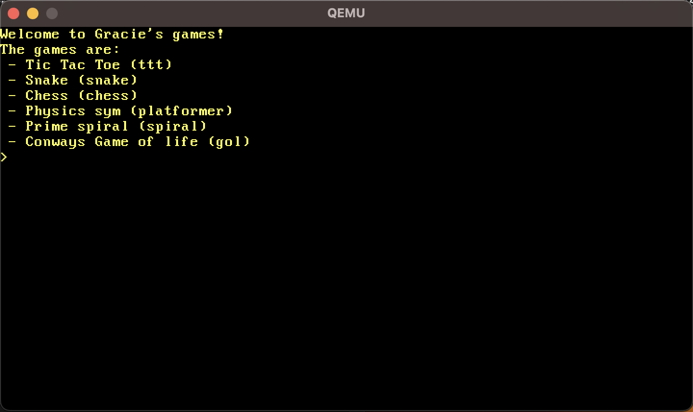
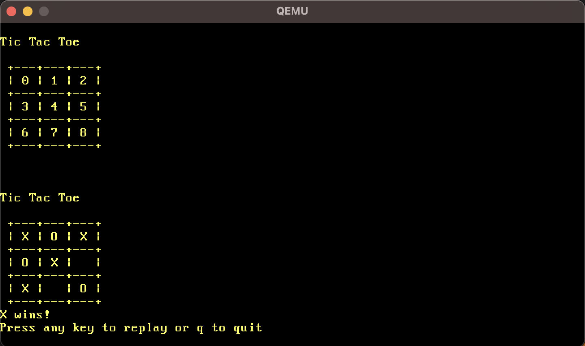
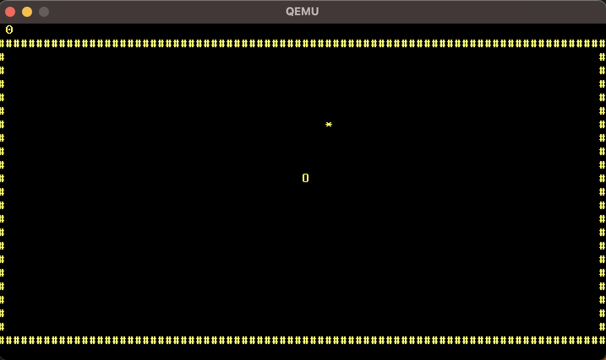
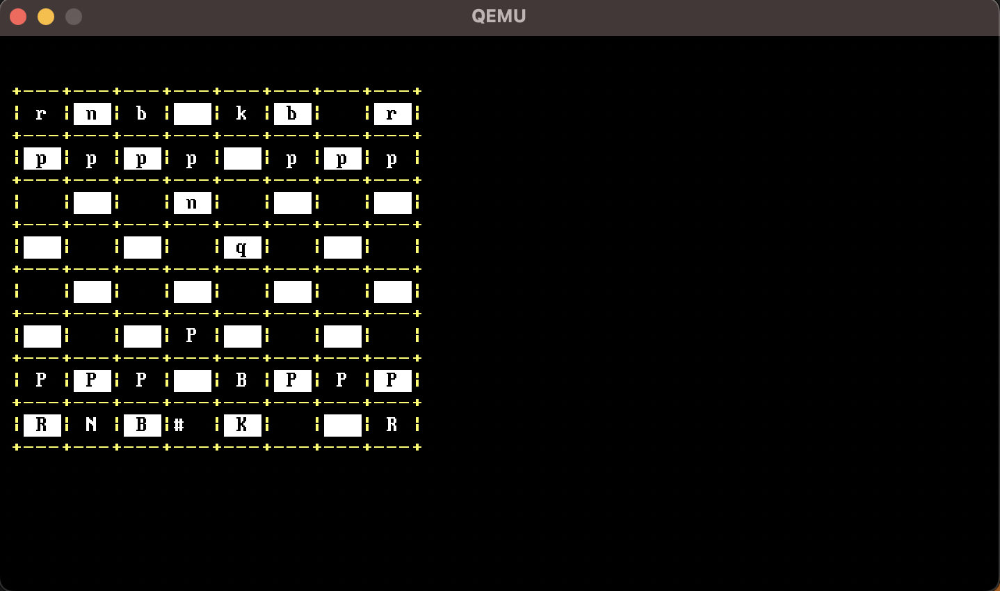
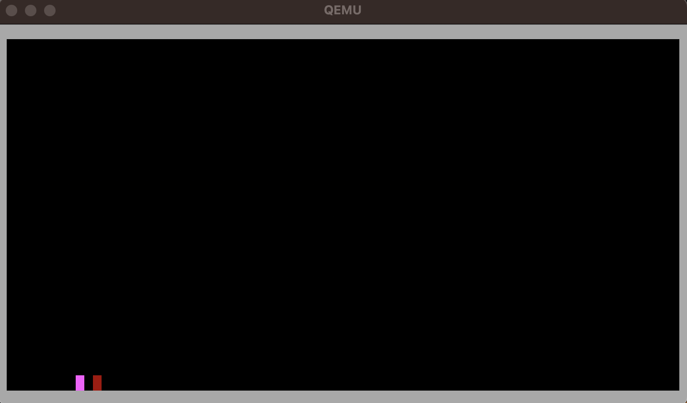
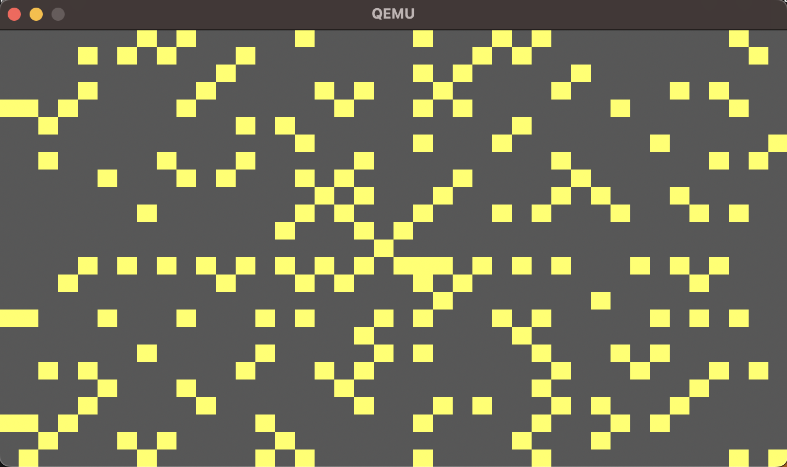
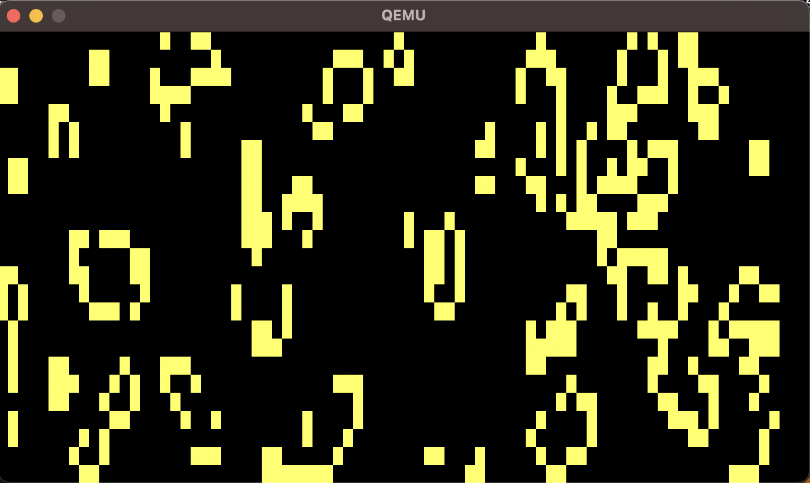

# Ggames OS

In my OS there are 6 games, Tic Tac Toe against an AI, Snake, Chess, a jumping cube, Prime spiral, and Conways game of life.

## Opening screen

You can type anything here and press enter or escape for no newline to be created, the available games are shown on the start screen. 
The games include:
 - Tic Tac Toe
 - Snake
 - Chess
 - A jumping cube with a stationary enemy
 - Prime spiral
 - Conways game of life



### Tic Tac Toe

Tic tac toe is against an AI and uses the minimax algorithm.



### Snake

Snake uses the arrow keys to move and ends when you hit the side. It only moves when you enter input because of the inability for multithreading and becasue I must wait for input.



### Chess

For Chess you must capture the king to end the game, there is no castling and it is a fairly flawed implementation but was very fun to make.



### A jumping cube

For this game you can jump with space or the up arrow and go left or right, this is limited because I must wait for user input and is quite glitchy.



### Prime spiral

For the prime spiral you run it and the ulam spiral will be drawn on the screen to fill it.



### Conways game of life

Conways game of life is a simulation which shows emergence properties from a simple set of rules and my implementation creates a random set of dead or alive cells and applies the rules to it.



## Compilation and setup

To setup and compile go to [this github page](https://github.com/davidcallanan/os-series/tree/ep2), I used this for the base os and it goes alongside [this youtube video](https://www.youtube.com/watch?v=FkrpUaGThTQ&list=RDCMUCUVahoidFA7F3Asfvamrm7w&index=3).


This is how to compile if you dont want to go to the other page:
 - Linux or MacOS: `docker run --rm -it -v "$(pwd)":/root/env myos-buildenv`
 - Windows (CMD): `docker run --rm -it -v "%cd%":/root/env myos-buildenv`
 - Windows (PowerShell): `docker run --rm -it -v "${pwd}:/root/env" myos-buildenv`

And to run you must have qemu installed and in your path:
 - `qemu-system-x86_64 -cdrom dist/x86_64/kernel.iso`

Or you can use VirtualBox:
 - Install virtual box from [here](https://www.virtualbox.org/wiki/Downloads)
 - Make a new machine and select:
    - the iso image as the one in path to project/dist/x86_64/kernel.iso
    - Type as other
    - Other/unknown (64-bit)
    - Leave the memory as it is
    - Select (do not add virtual disk)
    - Finish
 - Then Start the machine, it will be slower so you can go through and decrease all of the MSDelay commands a factor of 10.


## License

The MIT License as seen in the Licence.txt file or below.

```
MIT License

Copyright (c) 2023 Gracie Jackson

Permission is hereby granted, free of charge, to any person obtaining a copy
of this software and associated documentation files (the "Software"), to deal
in the Software without restriction, including without limitation the rights
to use, copy, modify, merge, publish, distribute, sublicense, and/or sell
copies of the Software, and to permit persons to whom the Software is
furnished to do so, subject to the following conditions:

The above copyright notice and this permission notice shall be included in all
copies or substantial portions of the Software.

THE SOFTWARE IS PROVIDED "AS IS", WITHOUT WARRANTY OF ANY KIND, EXPRESS OR
IMPLIED, INCLUDING BUT NOT LIMITED TO THE WARRANTIES OF MERCHANTABILITY,
FITNESS FOR A PARTICULAR PURPOSE AND NONINFRINGEMENT. IN NO EVENT SHALL THE
AUTHORS OR COPYRIGHT HOLDERS BE LIABLE FOR ANY CLAIM, DAMAGES OR OTHER
LIABILITY, WHETHER IN AN ACTION OF CONTRACT, TORT OR OTHERWISE, ARISING FROM,
OUT OF OR IN CONNECTION WITH THE SOFTWARE OR THE USE OR OTHER DEALINGS IN THE
SOFTWARE.
```
